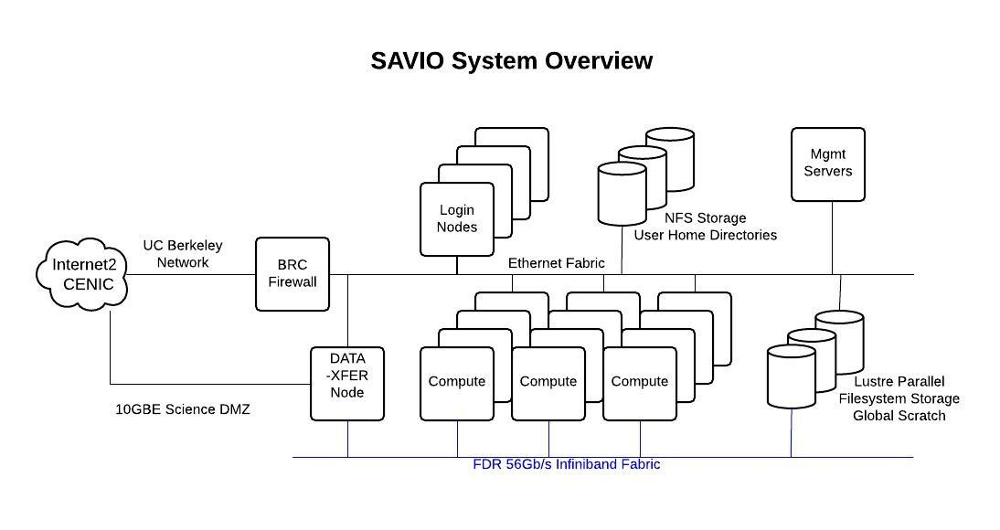

% Basic usage of the Berkeley Savio high-performance computing cluster

# Introduction


Much of this material is based on the extensive Savio documention we have prepared and continue to prepare, available at [http://research-it.berkeley.edu/services/high-performance-computing](http://research-it.berkeley.edu/services/high-performance-computing).


# Outline

This training session will cover the following topics:

 - System capabilities and hardware
     - Savio computing nodes
     - Disk space 
 - Logging in, data transfer, and software
     - Logging in
     - Data transfer: SCP/SFTP
     - Software modules
 - Submitting and monitoring jobs
     - Accounts and partitions
     - Interactive jobs
     - Basic job submission
     - Parallel jobs 
     - Monitoring jobs and cluster status
 - Exercise


# System capabilities and hardware

- Savio is a >380-node, >8000-core Linux cluster rated at >300 peak teraFLOPS. 
   - about 174 compute nodes provided by the institution for general access
   - about 211 compute nodes contributed by researchers in the Condo program


# Savio computing nodes

Let's take a look at the hardware specifications of the computing nodes on the cluster [(see the *Hardware Configuration* section of this document)](http://research-it.berkeley.edu/services/high-performance-computing/user-guide/savio-user-guide).

The nodes are divided into several pools, called partitions. These partitions have different restrictions and costs associated with them [(see the *Scheduler Configuration* section of this document)](http://research-it.berkeley.edu/services/high-performance-computing/user-guide/savio-user-guide). Any job you submit must be submitted to a partition to which you have access.

As part of the class allocation for Stat 243, we have access to all partitions, but please use the *savio* partition unless otherwise specified.

# Disk space 

When reading/writing data to/from disk, unless the amount of data is small, please put the data in your scratch space at `/global/scratch/SAVIO_USERNAME`. The system is set up so that disk access for all users is optimized when users are doing input/output (I/O) off of scratch rather than off of their home directories. Doing I/O with files on your home directory can impact the ability of others to access their files on the filesystem. 


# Login nodes, compute nodes, and DTN nodes 

Savio has a few different kinds of nodes:

 - login nodes: for login and non-intensive interactive work such as job submission and monitoring, basic compilation, managing your disk space
 - data transfer nodes: for transferring data to/from Savio
 - compute nodes: for computational tasks


<center></center>

# Logging in

To login, you need to have software on your own machine that gives you access to a UNIX terminal (command-line) session. These come built-in with Mac (see `Applications -> Utilities -> Terminal`). For Windows, some options include [PuTTY](http://www.chiark.greenend.org.uk/~sgtatham/putty/download.html).

You also need to set up your smartphone or tablet with *Google Authenticator* to generate one-time passwords for you. As requested you should have already done this before section.

Here are instructions for [doing this setup, and for logging in](http://research-it.berkeley.edu/services/high-performance-computing/logging-savio).

Then to login:
```
ssh SAVIO_USERNAME@hpc.brc.berkeley.edu
```

Then enter XXXXXYYYYYY where XXXXXX is your PIN and YYYYYY is the one-time password. YYYYYY will be shown when you open your *Google authenticator* app on your phone/tablet.

One can then navigate around and get information using standard UNIX commands such as `ls`, `cd`, `du`, `df`, etc.

If you want to be able to open programs with graphical user interfaces:
```
ssh -Y SAVIO_USERNAME@hpc.brc.berkeley.edu
```

To display the graphical windows on your local machine, you'll need X server software on your own machine to manage the graphical windows. For Windows, your options include *eXceed* or *Xming* and for Mac, there is *XQuartz*.


# Data transfer: SCP/SFTP

We can use the *scp* and *sftp* protocols to transfer files. 

You need to use the Savio data transfer node, `dtn.brc.berkeley.edu`. The file `bayArea.csv` is too large to store on Github; you can obtain it [here](https://www.stat.berkeley.edu/share/paciorek/bayArea.csv).


Linux/Mac:

```
# to Savio, while on your local machine
scp bayArea.csv paciorek@dtn.brc.berkeley.edu:~/.
scp bayArea.csv paciorek@dtn.brc.berkeley.edu:~/data/newName.csv
scp bayArea.csv paciorek@dtn.brc.berkeley.edu:/global/scratch/paciorek/.

# from Savio, while on your local machine
scp paciorek@dtn.brc.berkeley.edu:~/data/newName.csv ~/Desktop/.
```

If you can ssh to your local machine or want to transfer files to other systems on to which you can ssh, you can login to the dtn node to execute the scp commands:

```
ssh SAVIO_USERNAME@dtn.brc.berkeley.edu
[SAVIO_USERNAME@dtn ~]$ scp ~/file.csv OTHER_USERNAME@other.domain.edu:~/data/.
```

If you're already connected to a Savio login node, you can use `ssh dtn` to login to the dtn.

One program you can use with Windows is *WinSCP*, and a multi-platform program for doing transfers via SFTP is *FileZilla*. After logging in, you'll see windows for the Savio filesystem and your local filesystem on your machine. You can drag files back and forth.


# Software modules

A lot of software is available on Savio but needs to be loaded from the relevant software module before you can use it.

```
module list  # what's loaded?
module avail  # what's available
```

One thing that tricks people is that the modules are arranged in a hierarchical (nested) fashion, so you only see some of the modules as being available *after* you load the parent module. Here's how we see the Python packages that are available.

```
which R

module avail
module load r r-packages
which R
module avail
```


# Submitting jobs: accounts and partitions

All computations are done by submitting jobs to the scheduling software that manages jobs on the cluster, called SLURM.

When submitting a job, the main things you need to indicate are the project account you are using (for most of you this will only be ic_stat243, in which case you don't need to specify the account as it will be set by default)  and the partition.

You can see what accounts you have access to and which partitions within those accounts as follows:

```
sacctmgr -p show associations user=SAVIO_USERNAME
```

Here's an example of the output for a user who has access to various accounts. For your account you'll only see 'ic_stat243' as the accounts (in the second column) you have access to.


```
Cluster|Account|User|Partition|Share|GrpJobs|GrpTRES|GrpSubmit|GrpWall|GrpTRESMins|MaxJobs|MaxTRES|MaxTRESPerNode|MaxSubmit|MaxWall|MaxTRESMins|QOS|Def QOS|GrpTRESRunMins|
brc|ic_stat243|paciorek|savio2_1080ti|1||||||||||||savio_debug,savio_normal|savio_normal||
brc|ic_stat243|paciorek|savio_bigmem|1||||||||||||savio_debug,savio_normal|savio_normal||
brc|ic_stat243|paciorek|savio2_knl|1||||||||||||savio_debug,savio_normal|savio_normal||
brc|ic_stat243|paciorek|savio2_htc|1||||||||||||savio_debug,savio_long,savio_normal|savio_normal||
brc|ic_stat243|paciorek|savio2_gpu|1||||||||||||savio_debug,savio_normal|savio_normal||
brc|ic_stat243|paciorek|savio2|1||||||||||||savio_debug,savio_normal|savio_normal||
brc|ic_stat243|paciorek|savio|1||||||||||||savio_debug,savio_normal|savio_normal||
brc|ic_stat243|paciorek|savio2_bigmem|1||||||||||||savio_debug,savio_normal|savio_normal||
```


# Interactive jobs

You can do work interactively.

For this, you may want to have used the -Y flag to ssh if you are running software with a GUI such as MATLAB. 

```
# ssh -Y SAVIO_USERNAME@hpc.brc.berkeley.edu
srun -A ic_stat243 -p savio2  --nodes=1 -t 10:00 --pty bash
env | grep SLURM  ## see what environment variables are set by SLURM
# now execute on the compute node:
module load r r-packages
R
```

# Time limits

The -t flag sets an upper limit on how long your job will run. It is of the form:  D-HH:MM:SS, for Days, Hours, Minutes, Seconds. 

For your experimentation here and for any work on PS6, **DO NOT SET A TIME LIMIT MORE THAN 2 HOURS**, without checking with Chris or Omid.

We have a limited allocation of core-hours on Savio and if one person uses up a lot of that, it will impact the ability of everyone else to get their work done.

# Submitting a batch job

Or you can submit a job to run in the background.

Let's see how to submit a simple job. If your job will only use the resources on a single node, you can do the following. 


Here's an example job script (see also *example_loo.sh*) that you can run. *example_loo.R* does leave-one-out cross-validation in parallel using R's foreach package, with the *registerDoParallel* function telling R how many CPUs to use. You can think of *foreach* simply as a for loop where the output of the loop is (usually) a list that contains the results of each iteration's calculation.

```
#!/bin/bash
# Job name:
#SBATCH --job-name=test
#
# Account:
#SBATCH --account=ic_stat243
#
# Partition:
#SBATCH --partition=savio
#
# Wall clock limit (30 seconds here):
#SBATCH --time=00:00:30
#
## Command(s) to run:
module load r r-packages
R CMD BATCH --no-save example_loo.R example_loo.Rout
```

Now let's submit and monitor the job:

```
sbatch job.sh

squeue -j <JOB_ID>

wwall -j <JOB_ID>
```

When setting up parallel R code, you can find out how many cores there are on the node assigned to you with:

```
ncores <- Sys.getenv("SLURM_CPUS_ON_NODE")
```

Note that except for the *savio2_htc*  and *savio2_gpu* partitions, all jobs are given exclusive access to the entire node or nodes assigned to the job (and your account is charged for all of the cores on the node(s). 

# Parallel job submission

If you are submitting a job that uses multiple nodes, you may need to carefully specify the resources you need. The key flags for use in your job script are:

 - `--nodes` (or `-N`): indicates the number of nodes to use
 - `--ntasks-per-node`: indicates the number of tasks (i.e., processes) one wants to run on each node
 - `--cpus-per-task` (or `-c`): indicates the number of cpus to be used for each task

In addition, in some cases it can make sense to use the `--ntasks` (or `-n`) option to indicate the total number of tasks and let the scheduler determine how many nodes and tasks per node are needed. In general `--cpus-per-task` will be 1 except when running threaded code.

Here's an example job script for a job that uses Spark for parallelizing over multiple nodes:

```
#!/bin/bash
# Job name:
#SBATCH --job-name=test
#
# Account:
#SBATCH --account=ic_stat243
#
# Partition:
#SBATCH --partition=savio
#
# Number of tasks needed for use case (example):
#SBATCH --nodes=2
#
# Processors per task:
#SBATCH --cpus-per-task=1
#
# Wall clock limit:
#SBATCH --time=00:00:30
#
## Command(s) to run:
module load java spark/2.1.0 python/3.5
source /global/home/groups/allhands/bin/spark_helper.sh
spark-start
spark-submit --master $SPARK_URL $HOME/stat243-fall-2018/units/test_batch.py
spark-stop
```

When you write your code, you may need to specify information about the number of cores to use. (Though you shouldn't need to do this when using Spark on Savio. SLURM will provide a variety of variables that you can use in your code so that it adapts to the resources you have requested rather than being hard-coded. 

In addition to SLURM_CPUS_ON_NODE here are some of the variables that may be useful: SLURM_NTASKS, SLURM_CPUS_PER_TASK, SLURM_NODELIST, SLURM_NNODES.


# Monitoring jobs and the job queue

The basic command for seeing what is running on the system is `squeue`:
```
squeue
squeue -u SAVIO_USERNAME
squeue -A ic_stat243
```

To see what nodes are available in a given partition:
```
sinfo -p savio
sinfo -p savio2_gpu
```

You can cancel a job with `scancel`.
```
scancel YOUR_JOB_ID
```

For more information on cores, QoS, and additional (e.g., GPU) resources, here's some syntax:
```
squeue -o "%.7i %.12P %.20j %.8u %.2t %.9M %.5C %.8r %.3D %.20R %.8p %.20q %b" 
```

We provide some [tips about monitoring your job](http://research-it.berkeley.edu/services/high-performance-computing/tips-using-brc-savio-cluster).


# Exercise

Consider the Wikipedia traffic data in */global/scratch/paciorek/wikistats_small/dated/* on Savio.

Using either foreach or parSapply (or parLapply), write code that, in parallel, reads in the space-delimited file and filters to only the rows that refer to pages where "Barack_Obama" appears. Collect all the results across the 192 files into a single data frame. Run your code using an interactive session on either the Savio2 or Savio partition.

You should be able to use *looFit.R* as a template for your answer here. In addition, Section 4.3 of Unit 8 has example R code for doing either a parallel for loop or a paralllel lapply/sapply. 

Note that as we saw in class, the data are the number of hits on different Wikipedia pages for November 4, 2008. The columns are: date, time, language, webpage, number of hits, and page size.

